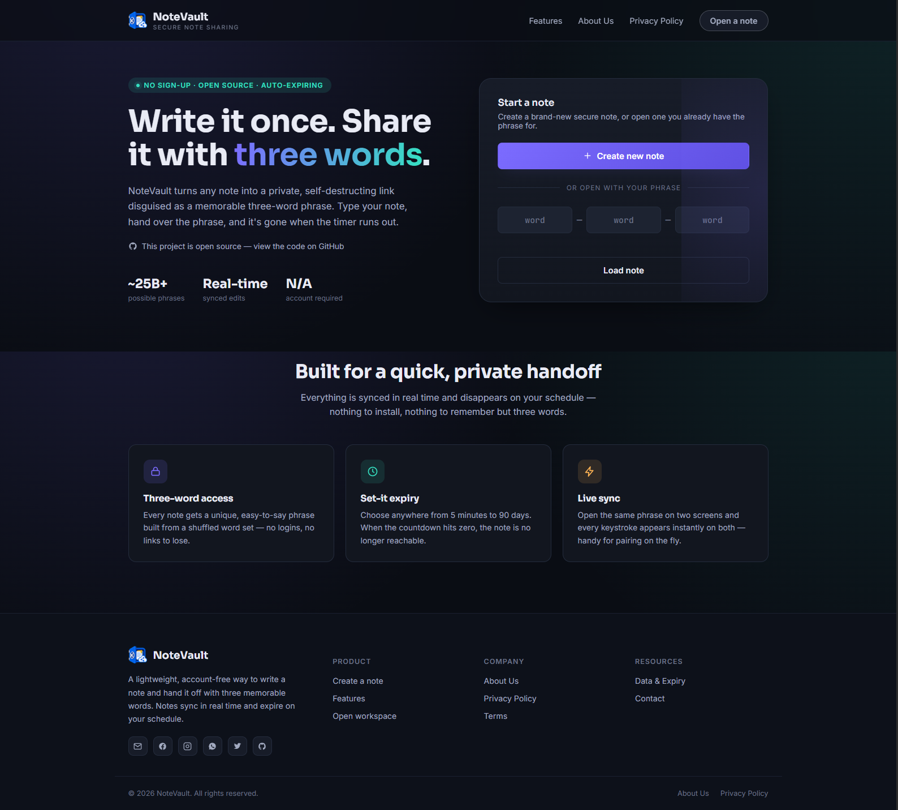
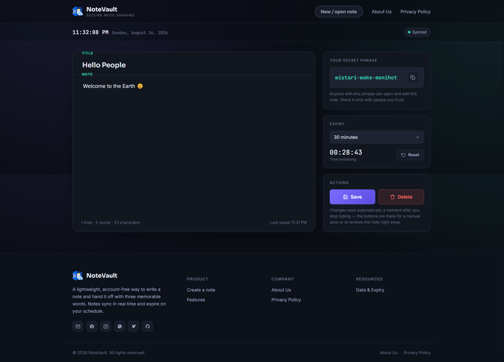

# 🔐 NoteVault

> **Write it once. Share it with three words.**

NoteVault is a lightweight, open-source, real-time note-sharing application designed for quickly sharing temporary notes without requiring an account, login, or shared drive.

Create a note, receive a unique **three-word phrase**, and share that phrase with someone. Anyone with the exact phrase can access and edit the note in real time. When the configured expiry time is reached, the note is no longer accessible.

---

## ✨ Features

* 🔑 **Three-word access phrases**

  * Every note receives a unique three-word phrase.
  * Easy to read, type, remember, and share.
  * No account or login required.

* ⚡ **Real-time synchronization**

  * Multiple people can open the same note simultaneously.
  * Changes are synchronized while users type.
  * Useful for quick collaboration and information handoffs.

* ⏳ **Automatic expiration**

  * Notes can be configured to expire automatically.
  * Available durations range from **5 minutes to 90 days**.
  * Expired notes become inaccessible through the application.

* 🗑️ **Manual deletion**

  * Notes can be permanently deleted before their expiry.
  * Once deleted, the phrase stops working immediately.

* 👤 **No account required**

  * No registration.
  * No login.
  * No username or password.
  * No personal profile is required to create or use a note.

* 📋 **Easy phrase sharing**

  * Copy the three-word phrase directly from the workspace.
  * Share the phrase through any communication platform.

* 📱 **Responsive interface**

  * Designed for desktop and mobile usage.
  * Simple workspace focused on writing and sharing.

* 🌐 **Open source**

  * The source code is publicly available.
  * Anyone can inspect, audit, modify, or self-host the project.

---

# 🖼️ Screenshots

## Landing Page

<!-- Replace the path below with your landing page screenshot -->



---

## Notes Workspace

<!-- Replace the path below with your notes page screenshot -->



---

# 🚀 How It Works

NoteVault is built around a simple concept:

**Create → Get Phrase → Share → Collaborate → Expire**

### 1. Create a note

From the NoteVault landing page, select **Create new note**.

A new note is created and assigned a unique three-word phrase.

Example:

```text
river-lamp-orbit
```

The three-word phrase acts as the access key for the note.

---

### 2. Share the phrase

Copy the generated phrase and send it to the person you want to share the note with.

You don't need to send a long URL or create an account.

For example:

```text
river-lamp-orbit
```

The recipient can enter the three words on the NoteVault landing page and open the note.

---

### 3. Open the note

The recipient enters the three-word phrase into the **Open with your phrase** fields.

If the phrase belongs to an active note, the NoteVault workspace opens.

The workspace displays:

* The note editor
* The secret phrase
* Word and character count
* Save status
* Expiry timer
* Manual save button
* Delete button

---

### 4. Write and edit in real time

The note editor automatically saves changes shortly after the user stops typing.

The workspace also provides a manual **Save** button.

Because the note is synchronized in real time, multiple people can work on the same note simultaneously.

This makes NoteVault useful for quick collaboration, temporary information sharing, and live text handoffs.

---

### 5. The note expires

Every note has an expiry duration.

Available options include:

```text
5 minutes
10 minutes
15 minutes
30 minutes
1 hour
3 hours
12 hours
1 day
3 days
7 days
30 days
90 days
Custom...
```

Once the expiry time is reached, the note becomes unavailable through the application.

---

### 6. Delete whenever you want

A note can also be manually deleted before its timer expires.

Deletion is permanent.

After deletion:

```text
The note content is erased
        ↓
The phrase stops working
        ↓
The note cannot be recovered
```

---

# 🔐 Three-Word Access System

Instead of requiring accounts, NoteVault uses a generated three-word phrase as the access mechanism.

For example:

```text
cactus-moon-river
```

The phrase is intended to be:

* Easy to read
* Easy to type
* Easy to communicate verbally
* Easier to remember than a long random identifier

The project combines word sets to provide a very large number of possible combinations, helping reduce the possibility of phrase collisions.

### Important

The three-word phrase should be treated like a password.

**Anyone who has the exact phrase can access and edit the note.**

Do not share the phrase publicly if the note contains information you want to keep private.

---

# ⏳ Expiry System

Notes are designed to be temporary rather than permanent archives.

When creating or editing a note, the user can select an expiry duration.

The available range currently extends from:

**5 minutes → 6 years**

The workspace displays a countdown showing the remaining time.

Users can also reset the timer using the selected expiry duration.

Once the expiry time passes, the note is no longer accessible through the application.

---

# 🗑️ Note Deletion

NoteVault supports two ways for a note to become unavailable:

### Automatic expiration

The configured timer reaches zero.

### Manual deletion

The user selects **Delete** and confirms the action.

Manual deletion permanently removes the note from active use, and the access phrase immediately stops working.

There is no recovery mechanism provided by the application.

---

# 🛡️ Privacy

NoteVault is designed around minimal account requirements.

According to the project's privacy information:

* No account is required.
* No name is required to use the note-taking features.
* No email is required to create or use a note.
* Note content is not sold.
* Notes are associated with their three-word phrases and expiry times.
* Anyone possessing the exact phrase can access and edit the associated note.

The note content, phrase, and expiry information are stored in the application's database so that notes can be reopened and synchronized.

---

# ⚠️ Security Considerations

NoteVault's three-word phrase is an **access credential**.

It should therefore be handled similarly to a password.

### Do

* Share phrases only with trusted people.
* Delete sensitive notes when they are no longer needed.
* Use short expiry periods for temporary information.
* Avoid posting note phrases publicly.

### Don't

* Use NoteVault as a permanent document archive.
* Share sensitive phrases in public channels.
* Assume that possessing the phrase provides identity verification.
* Treat a note as secure once its phrase has been exposed.

### Important distinction

NoteVault provides temporary access through a secret phrase, but the phrase itself is the authorization mechanism.

If someone obtains the phrase, they can access and modify the note while it remains active.

---

# 📖 Example Usage

Imagine you need to quickly send some instructions to a teammate.

Instead of creating an account or sending a permanent document:

### You

Create a NoteVault note:

```text
Deploy the new version after 8 PM.

Run:
npm install
npm run build
npm run deploy
```

NoteVault generates:

```text
forest-lamp-cloud
```

You send your teammate:

```text
Open NoteVault with:

forest-lamp-cloud
```

Your teammate enters the phrase and opens the same note.

Both users can work with the note while it remains active.

After the selected expiry period, the note becomes unavailable.

---

# 🎯 Use Cases

NoteVault can be useful for many short-lived information-sharing scenarios.

### 👨‍💻 Developers

Share:

* Temporary code snippets
* Commands
* Configuration instructions
* Deployment notes
* Debugging information

### 🤝 Teams

Share:

* Meeting notes
* Temporary instructions
* Quick handoffs
* Short task descriptions

### 🔄 Collaboration

Use the same note as a temporary shared workspace for two or more people.

### 📱 Quick sharing

Useful when you want to share text without creating an account or managing a permanent document.

---

# 🧑‍💻 Development

Clone the repository:

```bash
git clone https://github.com/itismdalamin/NoteVault.git
```

Move into the project:

```bash
cd NoteVault
```

Then configure the required backend/database environment for your deployment.

---

# 📜 Terms of Use

By using NoteVault, you acknowledge that:

1. You are responsible for the information you place in a note.
2. Anyone possessing the correct three-word phrase may access and edit the note.
3. You should not share note phrases with people you do not trust.
4. Notes are temporary and may become unavailable after expiration.
5. Deleted or expired notes should not be expected to be recoverable.
6. NoteVault should not be treated as a permanent storage system.
7. You should not use the service for information requiring guaranteed long-term availability.
8. You are responsible for complying with applicable laws and regulations when using the service.

---

# 🔒 Privacy Policy

NoteVault is designed to minimize account-related data collection.

The application's current privacy information states that note content, its associated three-word phrase, and expiry time are stored so notes can be reopened and synchronized. It also states that the service does not require an account or personal name/email for note-taking features and does not sell note content.

However, the exact privacy practices of a deployed instance depend on its backend, hosting provider, database, logging configuration, analytics, and infrastructure.

---

# ⚠️ Disclaimer

NoteVault is provided as an open-source project.

The software is provided **"as is"**, without warranties of any kind, express or implied.

The project maintainers are not responsible for:

* Lost notes
* Expired notes
* Accidentally deleted notes
* Unauthorized access caused by sharing an access phrase
* Service interruptions
* Database failures
* Hosting failures
* Data loss
* Misuse of the application

Do not use NoteVault as the sole storage location for critical information.

---

# 🤝 Contributing

Contributions are welcome!

If you would like to improve NoteVault:

1. Fork the repository.
2. Create a new branch.

```bash
git checkout -b feature/my-feature
```

3. Make your changes.
4. Test your changes.
5. Commit your work.

```bash
git commit -m "Add my feature"
```

6. Push the branch.

```bash
git push origin feature/my-feature
```

7. Open a Pull Request.

Please keep pull requests focused and explain what was changed and why.

---

# 🐛 Bug Reports

Found a bug?

Please open an issue and include:

* What happened
* What you expected to happen
* Steps to reproduce the issue
* Browser and device
* Relevant console errors
* Screenshots if applicable

Please **do not include private note content or secret phrases** in public bug reports.

---

# 💡 Feature Requests

Have an idea?

Open an issue describing:

* The problem
* Your proposed solution
* Why the feature would be useful
* Any examples or mockups

---

# 📄 License

NoteVault is open source and licensed under the MIT License.

Copyright (c) 2026 MD Alamin

See the [LICENSE](LICENSE) file for the full license text.

---

# 📊 Project Summary

| Feature           | NoteVault      |
| ----------------- | -------------- |
| Account required  | ❌ No           |
| Login required    | ❌ No           |
| Three-word access | ✅ Yes          |
| Real-time editing | ✅ Yes          |
| Automatic saving  | ✅ Yes          |
| Automatic expiry  | ✅ Yes          |
| Manual deletion   | ✅ Yes          |
| Shareable phrase  | ✅ Yes          |
| Temporary notes   | ✅ Yes          |
| Open source       | ✅ Yes          |
| Self-hostable     | ✅ Project goal |
| Permanent archive | ❌ No           |

---

# ❤️ Support the Project

If you find NoteVault useful:

⭐ Star the repository
🐛 Report bugs
💡 Suggest features
🔧 Submit pull requests
📢 Share the project

Every contribution helps improve the project.

---

## 🔗 Links

**GitHub Repository**

https://github.com/itismdalamin/NoteVault

**Author**

https://github.com/itismdalamin

---

<p align="center">
  <strong>NoteVault</strong><br>
  Write it once. Share it with three words.
</p>

<p align="center">
  Built with ❤️ as an open-source project.
</p>
